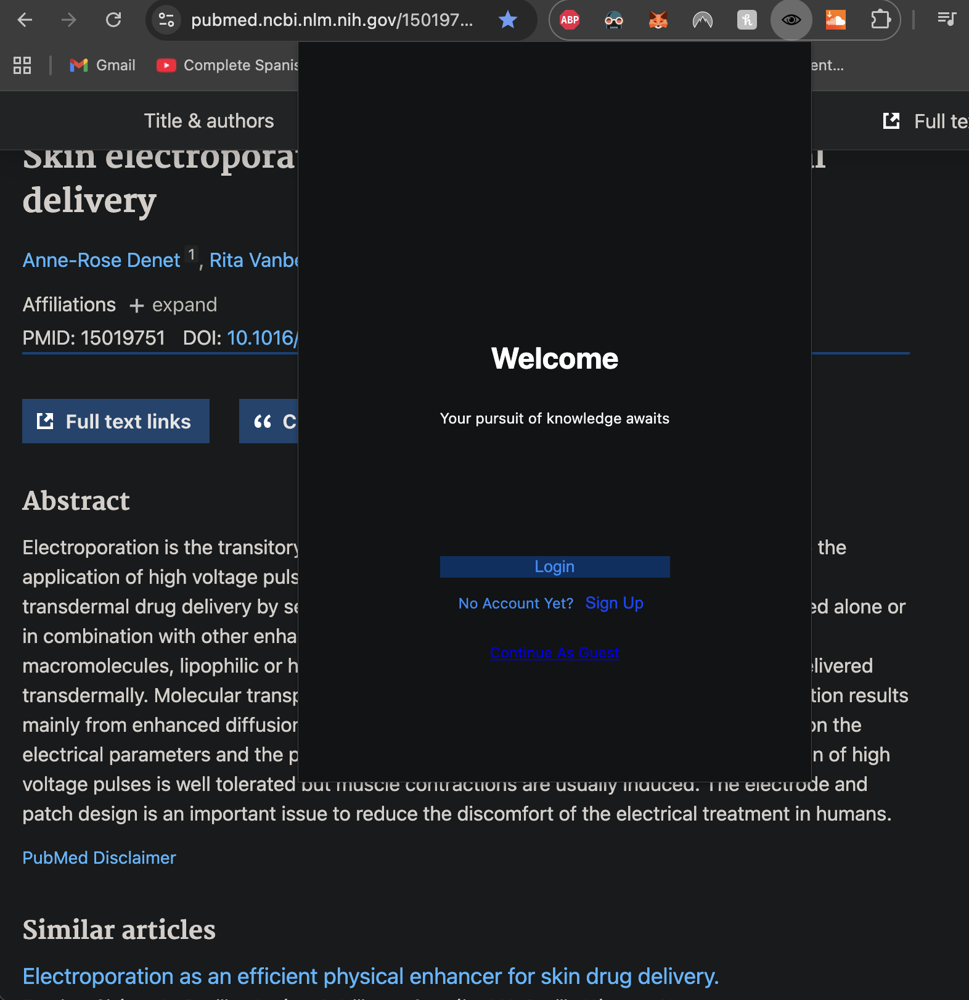
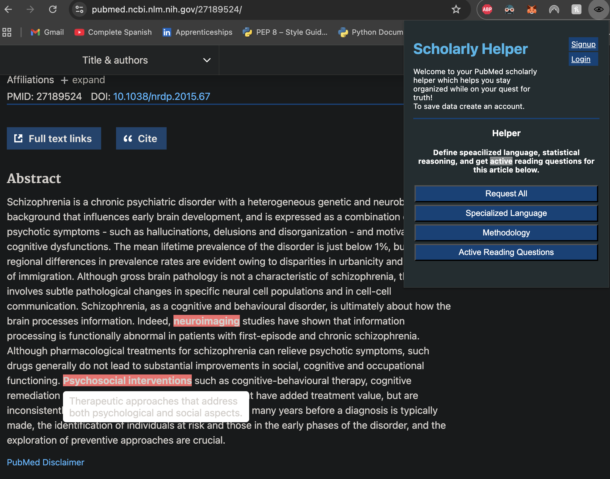

# Description
A chrome browser extension that helps a user to read scholarly articles, exclusivley on pubmed. This tool will allow a reader to examine information on one page, rather than opening a new tab to search for definitions. Two of the main issues that comes from reading scholarly articles are speacialized language and complex methodology. Option of two active learning questions per definition.

# MVP 
Problem: 
Scholarly articles readability is low due to specalized language and complex methodology. When reading through an article and stumbling across unknown verbage, one usually has to open a new tab to search for a definition in order to accuratly comprehend the reading. Sometimes a reader will unknowingly pass by a word thats definition is dependant on the respective field of discipline, a reader will often make the assumption that they know that word since they have used it in other contexts before, and thus will not fully understand the content.

Main Value: 
Heightens readablity of scholarly articles by identifying terms and methodology that need specification, while keeping all the details on one page. 

Market: 
Multiple chrome extensions offering similar tools are available and wanted, Scholarcy for example has over 600,000 users.

Tech Stack:
- HTML CSS Python Django ManifestV3 Postgresql
- ChatGPT API

Requirements:
- Needs to be activated on a PubMed url 
- AI prompts to identify and define all specalized language/verbiage within a field of discipline 
- AI prompts to explain methodology 
- GET from ChatGPTs API

Stretch Goals:
- AI prompts for active reading questions
- A user can place words or phrases in 2 categories: know, learning. The ones that are known are omitted from the output
- refactor frontend to be in react
- Implement Prompt caching
- Instead of using innerHTML use the Range api

User Journey:
1. Opens chrome extension on a PubMed journal 
2. Login or Continue As Guest
3. Choose if you want only one feature activated or all three (language, methodology, questions)
4. User reads through journal 

** to run: python3 manage.py runserver

# Welcome Page

# Home Page

# Specialized Language 

# Sprint (agile)

*Week 1: Extension + Basic Backend*

Day 1–2: Chrome Extension Setup | 6/24
- ✅ Set up manifest.json and content scripts  
- ✅ Target PubMed pages and inject scripts correctly 
- ✅ Extract article content (abstract, body) 

Day 3–4: Backend Setup (Django) | 6/25 - 6/26
- ✅ Create db (named: ai_scholarly_helper_development & ai_scholarly_helper_test)
- ✅ Update Django settings.py to connect postgresql database
- ✅ Confirm connection
- ✅ Set up django rest framwork
- ✅ Create an endpoint
- ✅ Accept plain text input (article section)

Day 5: Connect Extension ↔ Django | 6/26
- ✅ From the extension, send article content to Django via fetch (CORS setup)
- ✅ Receive and log a placeholder response
- ✅ Above testing in POSTMAN
- ✅ Confirm browser → extension → Django pipeline works

Day 6–7: Add ChatGPT API Integration 6/27
- ✅ Design response data structures for each view (decide JSON shape) || workflow: decide endpoints → determine view type → implement view → implement url → test with postman
  - ✅ Create endpoints for all 4 views 
  - ✅ Decide view type for all 4 views 
  - ✅ Create view #1: Specialized language only
  - ✅ Create view #2: Methodology explanations only
  - ✅ Create view #3: Combined specialized language + methodology
  - ✅ Create view #4: Specialized language + methodology + active reading questions for each term
  - ✅ Add active reading questions generation via placeholder
  - ✅ Design JSON to include questions linked to terms
  - ✅ Add URL routes for all 4 views
  - ✅ Test with postman 200OK
- ✅ In Django 
  - ✅ send terms/text to ChatGPT API using OpenAI’s SDK
- ✅ Prompt it to extract & define:
  - ✅ Specialized terms
  - ✅ Complex methodologies
-  ✅ Return structured response to extension

*Week 2: Frontend UI, UX, Testing & Polish*

Day 8–9: Render Definitions in Chrome Extension 7/21
- ✅From API response, inject highlights into DOM for each term
- ✅On hover/click, display definitions in a tooltip or popup
- ✅Style tooltips with CSS (optionally use Popper.js or custom CSS)
- Create a collapsable right side page with all terms and toggle for definitions  
- ✅Traverse DOM and wrap matched terms using term
 ✅Avoid highlighting inside <script>, <style>, or existing highlight spans.
 ✅ Style with CSS for visual clarity (.highlighted-term)
Tooltip/Popup on Hover or Click
 ✅ On hover, show a styled tooltip near cursor or element with innerText = data-definition

Day 10: Fallback UI, Improve Caching & Reliability 01/12/2026
- ✅ Identify where tooltip text is set
- ✅ Identify where definition data might be missing
- ✅ Decide what text represents a “fallback” (e.g. "No definition found")
- ✅ Ensure tooltip still renders with fallback text
Add visual distinction for fallback (color, italics, opacity)
- ✅ Identify all places where external data is read
- ✅ Identify assumptions (e.g. “this value always exists”)
- ✅ Replace assumptions with safe defaults
- ✅ Log errors instead of throwing them
- ✅ Confirm extension keeps working even with bad payloads
- ✅ Handle no-definition or API error gracefully in Django & Chrome Extension
- ✅ Add fallback “no definition found” UI

Day 11–12: Extension UI Enhancements 1/13/26
- ✅ Clean up views/urls/popup.js/pubmed-content.js make sure all buttons respond correctly and all functions the fetch data have proper error handeling and clear logs
- ✅ Build out questions for regex terms 
- ✅ Handle questions for a term 
- ✅ style questions in tooltips
- ✅ Add loading spinner or "processing" state
- When a new button is clicked unhighlight what is highlighted and highlight the new terms 
  - There should never be nested .highlighted-term spans
  - Highlighting should not modify original text permanently
  - Removing highlights should fully restore original DOM text
- Only highlight the abstract text, not the full page
- ✅ Style tooltips for clarity, accessibility 

Day 13-15: Finish handeling api calls and responses
- Build out data for answers to be handled in the tool tips
- Answers should be toggled 
- Style answers in the tooltips  
- Chain prompts using LangChain to create more precise responses with less hallucinations

Day 16: Testing & Debugging
- Test on:
  - Abstract-only articles
  - Design a stable abstraction around DOM readiness
  - Observe dom mutations with a mutation observer 
  - Fix common DOM bugs or mis-parses

Day 17: Refactor & Demo & Feedback
- Show to academics, friends, or peers -> Gather UX feedback
- Small UX changes (if the feedback applies)
- Create Demo video 
- Document edge cases 
- Consider more features and refactor 

# Learnings
CSP will block by code 
InnerHTML to traverse the dom can break existing js code due to innerhtml reparses 
Rendering of the Pubmed relative to my own javascript throws off my document.querySelect of the abstract in my content script 
TreeWalker
getBoundingClientRect()
`?.` prevents 'undefined length' errors 
Open–Closed principle (OCP) -- states that software entities (classes, modules, functions, etc.) should be open for extension but closed for modification

# Notes
Common DOM Structure for PMC Article Pages (pmc.ncbi.nlm.nih.gov)

Title  
`h1.content-title` 
This is the main article title.  

Authors  
`div.contrib.contrib-author` 
Contains author names, affiliations, etc. 

Abstract  
`div.abstract-content.selected` 
Note: use abstract-content.selected class, indicates active display  

Section Headers & Body 
`section.sec` 
All major sections are wrapped in `<section class="sec">`. 

Figures, Tables, References, Supplementary Material 
`
 / <figure>`  
`
` 
`
` 
`
` 

Work-Flow for mvu
create model 
add a path to that model in the urls specific to the app

DataFlow:
User clicks a button in popup →
popup.js sends a message to content script →
content script fetches the article section →
popup.js POSTs to Django →
Django → ChatGPT → returns JSON →
popup.js receives response →
popup.js sends response to content script →
content script highlights elements in the response in the webpage

Clarify Data Model 
1. users
Stores basic user information.

Column	Type	Notes
id	UUID	Primary key
name	TEXT	Full name
email	TEXT	Unique
username	TEXT	Unique
created_at	TIMESTAMP	Default: now()

2. saved_articles
Stores articles saved by users (metadata only).

Column	Type	Notes
id	UUID	Primary key
user_id	UUID	FK → users(id)
title	TEXT	Article title
url	TEXT	Link to journal or PubMed
pubmed_id	TEXT	PubMed ID
saved_at	TIMESTAMP	Default: now()

3. article_notes
Each note is linked to a saved article.

Column	Type	Notes
id	UUID	Primary key
article_id	UUID	FK → saved_articles(id)
content	TEXT	User-written note
created_at	TIMESTAMP	Default: now()
updated_at	TIMESTAMP	Update on edit

4. known_terms
Stores individual terms a user adds to their “library.”

Column	Type	Notes
id	UUID	Primary key
user_id	UUID	FK → users(id)
term	TEXT	Known or saved term
added_at	TIMESTAMP	Default: now()

                           ┌────────────┐
                           │   users    │
                           ├────────────┤
                           │ id (PK)    │◄──────────────┐
                           │ name       │               │
                           │ email      │               │
                           │ username   │               │
                           │ created_at │               │
                           └────┬───────┘               │
                                │                       │
              ┌────────────────┘                       │
              │                                        ▼
     ┌───────────────────┐                    ┌────────────────┐
     │  saved_articles   │                    │   known_terms  │
     ├───────────────────┤                    ├────────────────┤
     │ id (PK)           │                    │ id (PK)        │
     │ user_id (FK)──────┘                    │ user_id (FK)───┘
     │ title            │                    │ term           │
     │ url              │                    │ added_at       │
     │ pubmed_id        │                    └────────────────┘
     │ saved_at         │
     └────┬─────────────┘
          │
          ▼
 ┌────────────────────┐
 │   article_notes     │
 ├────────────────────┤
 │ id (PK)            │
 │ article_id (FK)────┘
 │ content            │
 │ created_at         │
 │ updated_at         │
 └────────────────────┘
